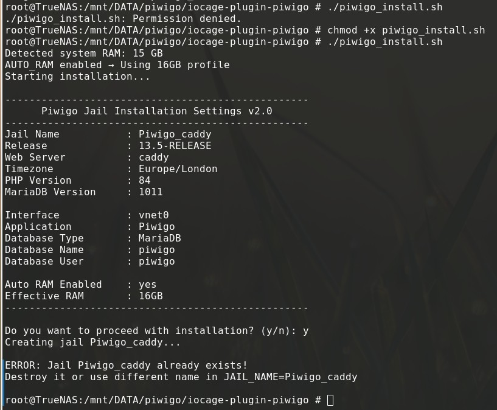
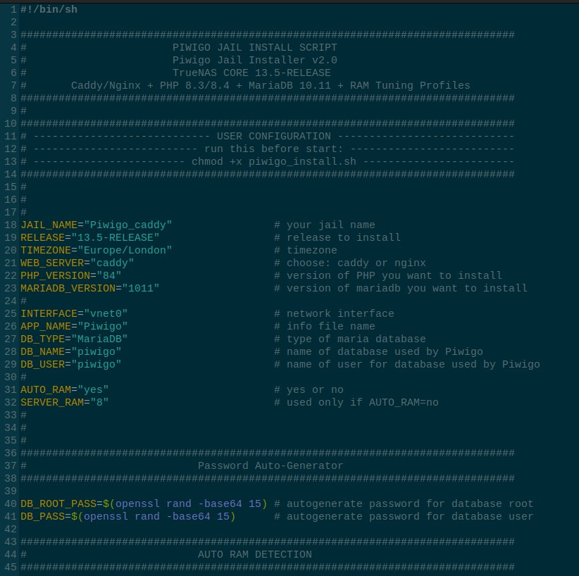
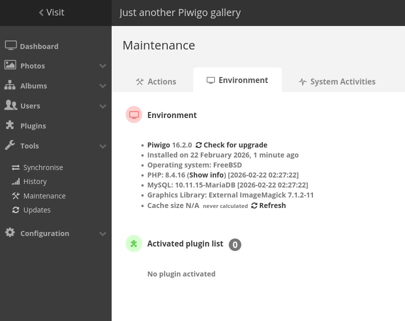

# Piwigo-Jail-Auto-Installer-for-TrueNAS-iocage
## Piwigo Jail Installer for TrueNAS CORE 13.5  
### Version v2.0 – Dynamic RAM Scaling Edition


---

## 📌 Overview

This script installs a fully tuned **Piwigo** instance inside a FreeBSD jail on **TrueNAS CORE 13.5-RELEASE**.

It automatically configures:

- Piwigo (latest)
- PHP 8.4
- MariaDB 10.11
- Caddy **or** Nginx
- ImageMagick
- ffmpeg
- EXIF support
- Automatic RAM-aware tuning
- Secure PHP-FPM pool
- Optimized database settings
- Production-ready web server config

validation-shell
 
 

---

## ✅ Tested On

- TrueNAS CORE 13 U7+
- Jail Release: 13.5-RELEASE
- Script Version: v2.0
- PHP 8.4
- MariaDB 10.11

---

# 🚀 What’s New in v2.0

- ✅ Automatic RAM detection
- ✅ Dynamic scaling for 4GB → 64GB+ servers
- ✅ Smart MariaDB tuning
- ✅ Adaptive PHP-FPM worker scaling
- ✅ OPcache auto sizing
- ✅ Secure PHP-FPM socket configuration
- ✅ Proper jail existence detection
- ✅ Caddy or Nginx selectable
- ✅ Production-grade performance defaults

---

# 🧠 RAM Auto-Detection & Scaling

The script can automatically detect system RAM:

```bash
AUTO_RAM="yes"
```

If enabled, it:

- Detects real physical memory
- Adjusts:
  - MariaDB buffer pool (≈ 25% RAM)
  - PHP-FPM max_children
  - OPcache memory
  - max_connections
  - Upload limits

Supports:

- 4GB
- 8GB
- 16GB
- 32GB
- 64GB+
- Any custom amount

You can override detection:

```bash
AUTO_RAM="no"
SERVER_RAM="8"
```

---

# ⚙️ How Scaling Works

| RAM | InnoDB Buffer Pool | PHP Workers | OPcache |
|------|--------------------|------------|----------|
| 4GB  | 1G                 | ~16        | 128MB    |
| 8GB  | 2G                 | ~32        | 192MB    |
| 16GB | 4G                 | ~64        | 256MB    |
| 32GB | 8G                 | ~128       | 512MB    |
| 64GB | 16G                | ~256       | 512MB    |

Scaling is proportional and capped safely to prevent overcommit.

---

# 🖥 Web Server Options

You can choose:

```bash
WEB_SERVER="caddy"
```

or

```bash
WEB_SERVER="nginx"
```

---

## 🔵 Caddy (Recommended)

Pros:
- Automatic HTTP/2 & HTTP/3
- Automatic compression (zstd + gzip)
- Cleaner configuration
- Modern defaults
- Simpler maintenance

Best for:
- Home use
- Simpler deployments
- Lower maintenance

---

## 🟢 Nginx

Pros:
- Fine-grained control
- Highly customizable
- Widely used in enterprise

Best for:
- Advanced users
- Reverse proxy setups
- Complex hosting environments

---

# 📂 Mount Points (Highly Recommended)

To ensure persistent storage, create datasets and mount them into the jail:

| Path | Purpose |
|------|---------|
| `/usr/local/www/piwigo/local/config` | Piwigo configuration |
| `/usr/local/www/piwigo/galleries` | Photo storage |
| `/usr/local/www/piwigo/upload` | Upload directory |
| `/var/db/mysql` | MariaDB database storage |

Example:

```bash
iocage fstab -a Piwigo_135 /mnt/tank/piwigo/galleries /usr/local/www/piwigo/galleries nullfs rw 0 0
```

---

# 📦 Installation

## 1️⃣ Clone Repository

```bash
git clone https://github.com/AfroUSApl/Piwigo-Jail-Auto-Installer-for-TrueNAS-iocage.git
cd Piwigo-Jail-Auto-Installer-for-TrueNAS-iocage
```

## 2️⃣ Edit Configuration

Edit:

```
piwigo_install.sh
```

Key variables:

```bash
JAIL_NAME="Piwigo_135"
RELEASE="13.5-RELEASE"
WEB_SERVER="caddy"
AUTO_RAM="yes"
```

## 3️⃣ Make Executable

```bash
chmod +x piwigo_install.sh
```

## 4️⃣ Run Installer

```bash
./piwigo_install.sh
```

---

# 🔐 Security Features

- MariaDB bound to 127.0.0.1
- PHP-FPM via Unix socket
- Hidden file blocking
- Config file blocking
- PHP execution blocked inside upload directory
- Server signature removed
- Proper file permissions
- Separate PHP pool
- Secure OPcache configuration

---

# 🛠 PHP Tuning Applied

Automatically configured:

```
memory_limit
upload_max_filesize
post_max_size
max_execution_time
cgi.fix_pathinfo=0
opcache.enable=1
```

OPcache memory scales automatically.

---

# 🛠 MariaDB Tuning Applied

```
innodb_buffer_pool_size
innodb_log_file_size
innodb_flush_method=O_DIRECT
max_connections
utf8mb4
```

Optimized for gallery workloads.

---

# ⚠️ Install Notes

During first web setup:

Use:

```
Database Host: 127.0.0.1
```

NOT:

```
localhost
```

Otherwise authentication may fail.

---

# 🔄 Upgrade Jail Release

Outside jail:

```bash
iocage upgrade -r 13.5-RELEASE Piwigo_135
```

Inside jail:

```bash
pkg update
pkg upgrade -y
```

---

# 📊 Performance Benefits

- Fast image serving
- Lower PHP CPU usage (OPcache)
- Optimized database caching
- Large upload support
- High concurrency capability
- Proper FreeBSD socket handling
- ZFS-friendly tuning

---

# 🏷 Version Information

- TrueNAS Target: 13.5-RELEASE
- Script Version: v2.0
- PHP: 8.4
- MariaDB: 10.11
- Web Server: Caddy or Nginx

---

# ⚠ Disclaimer

- Not an official iXsystems plugin.
- Designed for advanced TrueNAS users.
- Use at your own risk.
- Always backup before upgrades.

---

# 🚀 Enjoy Your Self-Hosted Gallery

If you found this useful, consider starring the repository ⭐
